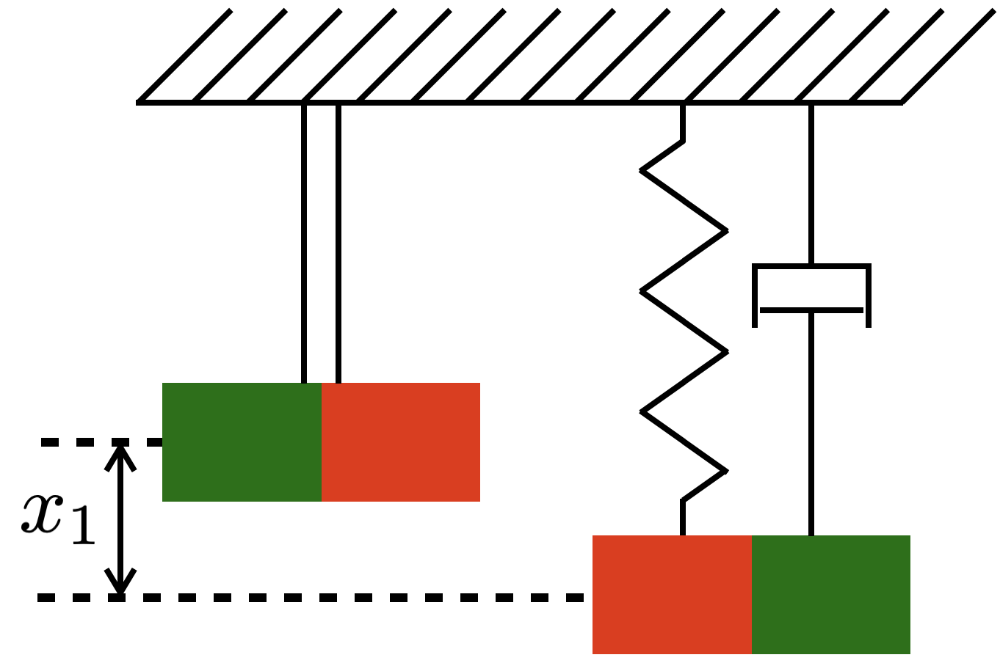

# PyGpPhs Package

The PyGpPhs package is designed for utilizing Gaussian Process for port-Hamiltonian system.

The PyGpPhs toolbox is developed using in Python and C++. The main
structure of the toolbox is written in Python while a
few computationally expensive functions, such as the ker-
nel and Cholesky decomposition functions, are written
in C++ . While two languages are used to develop the
PyGpPhs toolbox, the important notion of encapsulation
and abstraction are largely realized. Utilizing C++ data
types and function calls are handled internally by the
model class, thus leaving no explicit overheads for the users
to consider the C++ internal workings or invoke function
calls.

## Installation

**Requirements**:
- Python>=3.8
- numpy>=1.18.0 
- torch>=1.8.0 
- scipy>=1.4.0 
- gpytorch>=1.5.0

**Installation Instruction**:
The heart of PyGpPhs is located in the folder "PyGpPhs". It is essential to 
clone the folder repository locally in order to utilize the functionality of the 
model.

1, Open the terminal and navigate to a desired directory

2, Type in the following git command to clone the repository
```commandline
git clone https://github.com/PyGpPhs-Source/PyGpPhs.git
```

3, The repository should be seen at your desired directory. User can refer to the "example.py" 
for more information on how to use the package. The main.py file, or any file as the driver
to the simulation, can be located either inside PyGpPhs folder or outside. "example.py" shows an demonstration
of running the driver file outside the toolbox directory. Inside the PyGpPhs folder,
user can see "main.py" as an example of running the driver file.

**Important dependency:**
This package relies on the following packages in python:
- [gpytorch](https://github.com/cornellius-gp/gpytorch/tree/master) (Gaussian Process regression to take gradients on)
- scipy.integrate (integration of state variable)
- numpy (generic mathematical programming)
- ctypes (handling communication and results between python and C\C++)
- glob (reading .so files, compiled from C\C++, from python)

Important libraries from C++ is:
- [Eigen Dense](https://eigen.tuxfamily.org/index.php?title=Main_Page) (For fast matrix computations)
- stl vector class which should be already included.

**Please note the toolbox can be run on most machine whose operating system uses .so or .dll files**

For Mac machines, .so files are provided and python script will directly handle the internal and external interactions with .so.
Hence, everything should run on Mac. For Windows machines, the .dll extension files are offered and integrated. The python script will automatically handle
internal and external interactions with .dll, leaving no user overheads. Majority of the OS can run the toolbox flawlessly.
However, for some users whose computer does not read .dll or .so files, it is sometimes necessary to recompile the .c and .cpp files used.


## Magnet Oscillator explaination:
**Example.py explaination:**
The example simulation serves as a reference and instructor to use PyGpPhs toolbox. The example, or case-study,
is a nonlinear magnet oscillator system shown below:


The parameters to the port-Hamiltonian system is given to be:
```math
H(x) = \frac{x_1^2}{2}+2\cos(x_0)+\frac{x_2^2}{2}-1
```

```math
G(x)=[0, 1]^T
```

```math
u(t)=0.1\sin(t)
```

```math
J-R=\begin{bmatrix}
        0&1\\\
        -1&-R
    \end{bmatrix}, \text{ where }R=0.1.
```

## Reference:
[https://gpytorch.ai]gpytorch
[https://scholar.google.de/citations?view_op=view_citation&hl=de&user=WBA4xBcAAAAJ&citation_for_view=WBA4xBcAAAAJ:QIV2ME_5wuYC]Paper
